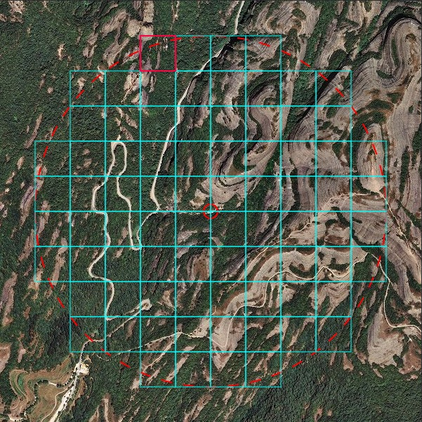
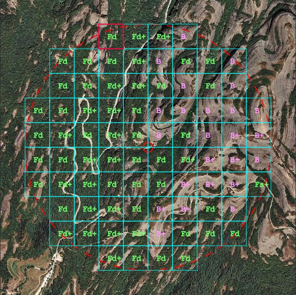
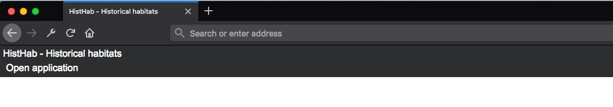
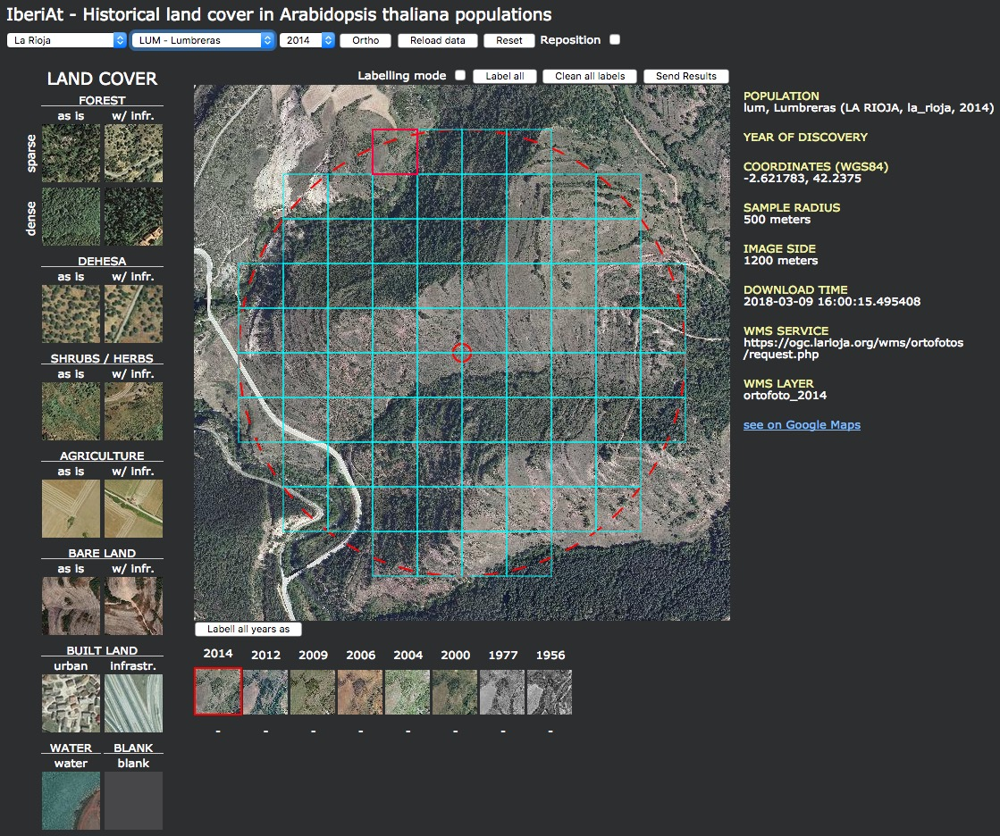
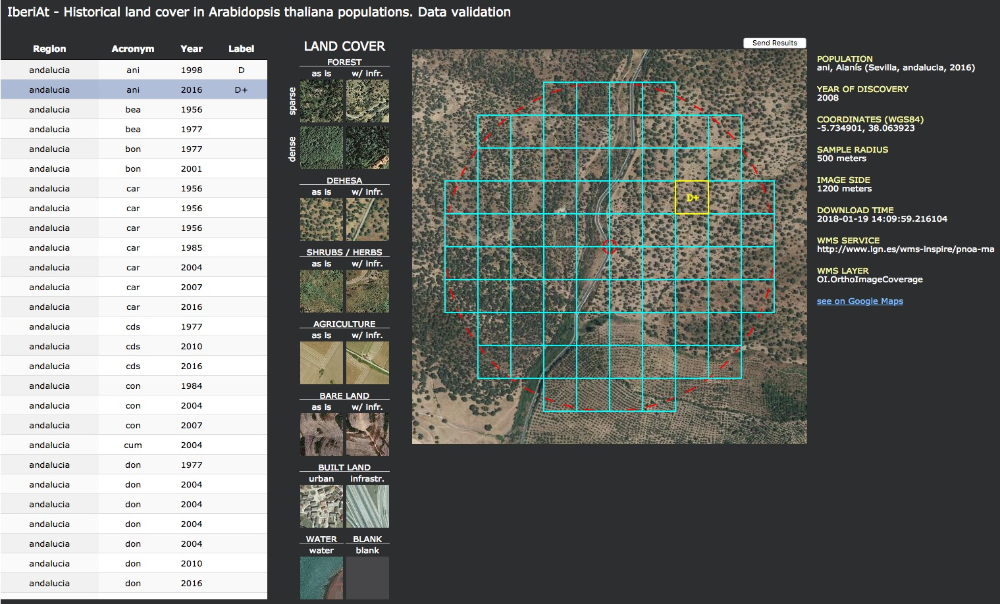
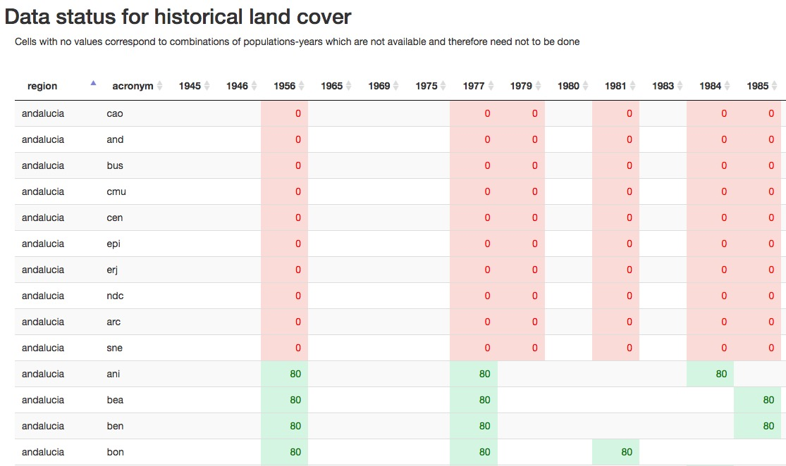
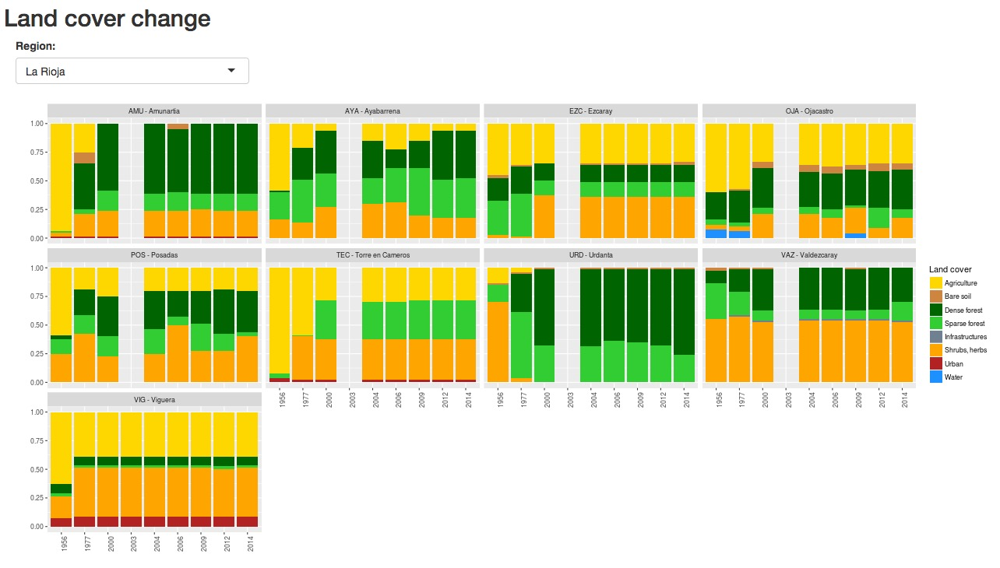
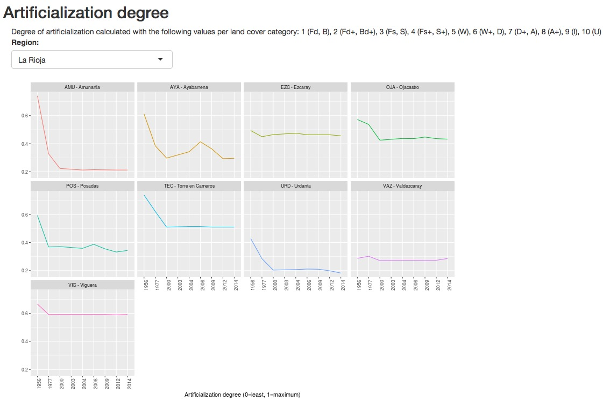
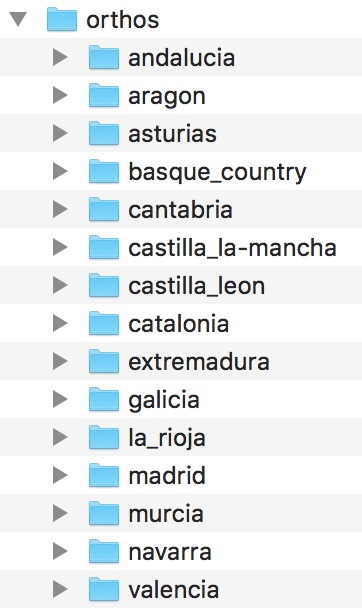
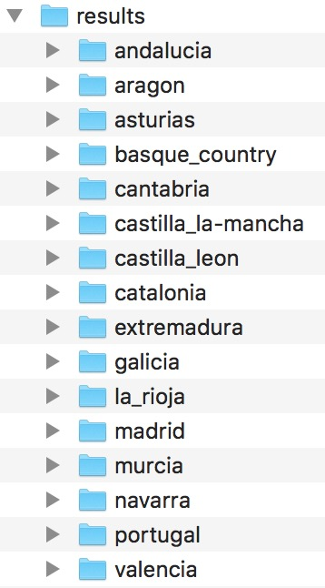

# HistHab - Historical Habitats

* Arnald Marcer  
 \- *CREAF, Cerdanyola del Vallès 08193, Spain*  
 \- *Univ. Autòonoma de Barcelona, Cerdanyola del Vallès, Spain*
 
* F. Xavier Picó  
 \- *Departamento de Ecología Integrativa, Estación Biológica de Doñana (EBD), Consejo Superior de Investigaciones Científicas (CSIC), Sevilla 41092, Spain*

<!-- ###################################################################################################### -->
## Table of contents  

 * [Background](#Background)  
 * [Historical orthoimages dataset](#historical-orthoimages-dataset)  
 * [HistHab applications](#histhab-applications)  
    + [Web portal](#web-portal)  
    + [Historical land cover](#historical-land-cover)
    + [Data validation](#data-validation)  
    + [Data status](#data-status)  
    + [Historical land cover change](#historical-land-cover-change)  
    + [Human impact](#human-impact)  
* [Configuration and server-side](#configuration-and-server-side)      
    + [Web portal](#web-portal-1)  
    + [Historical land cover](#historical-land-cover-1)    
    + [Data validation](#data-validation-1)  
    + [Data status](#data-status-1)  
    + [Historical land cover change](#historical-land-cover-change-1)  
    + [Human impact](#human-impact-1)  
    + [Server-side backent](#server-side-backend)  
* [References](#references)      

<!-- ###################################################################################################### -->
## Background  
**Preliminary note:** The following applications have been developed with the aim of building a historial database of land cover around wild populations of *Arabidopsis thaliana* in the Iberian peninsula, and what is here explained is tailored to that end. However, the tool can be accomodated to other species and study areas with a small development effort.  

This application is designed to make **historical local maps of land cover around natural populations** of *Arabidopsis thaliana*. These maps are **circular buffers** of a given radius (500 meters) around a **central population coordinate** and are **discretized in square units** of a given size (100 meters) (Figure 1) which can be manually labelled with a given land cover category (Figure 2). The category is assigned according to the criterion of **predominant land cover category** in the square (largest area). Currently, land cover categories are fixed within the application (see below). For each population there are as many orthoimages as years available.  

<!-- ###################################################################################################### -->
## Historical orthoimages dataset  
For the *Historical land cover* and *Data validation* applications to be used, historical orthophotographies need to be prepared beforehand. In the case of the Iberian peninsula, these have been obtained through the spatial data infrastructures of the central and regional governments with a python application (please refer to project [https://github.com/arnaldmarcer/ath_hist](https://github.com/arnaldmarcer/ath_hist)).

<!-- ###################################################################################################### -->

## HistHab applications  
The following applications are bundled together in a web page and together they allow to handle the photointerpretation and labelling of historical orthoimages.

<!-- ====================================================================================================== -->

### Web portal  
This is a simple web page with a menu option, *Open application*, from which the rest of the applications can be accessed.

<!-- ====================================================================================================== -->
### Historical land cover
This is the main application (see Figure 4) which allows to label historical land cover categories (see Figure 1 and 2) for each orthoimage prepared (see [Historical orthoimages dataset] section above). Land cover categories have been preestablished and thougth in the context of natural environments in the Iberian peninsula. In order to use other categories some code tweaking would be necessary. As of this version the land cover categories are shown in the table below. Categories with a `+` sign mean that within the labelled square there is the presence of some sort of human element, *e.g.* road, building, etc.    

| Land Cover      | Label    |
|-----------------|----------|
| Dense forest    | Fd / Fd+ |
| Sparse forest   | Fs / Fs+ |
| Dehesa          | D / D+   |
| Shrubs / Herbs  | S / S+   |
| Bare land       | B / B+   |
| Urban           | U        |
| Infrastructures | I        |
| Water           | W        |
|                 |          |  

As noted above, categories are assigned to each square in the grid according to a predominance criterion, *i.e.* the square is labelled with the land cover category with the largest area within it.  

**USAGE**  

* Use dropdown controls above page to select the population  
* **Ortho** button: Shows only orthoimage  
* **Reload data** button: Reloads data from server for the given population  
* **Reset** button: Erases all labels and repositions population to original coordinates  
* **Reposition** checkbox: Allows to relocate the population coordinates  
* **Labelling**
    + Check the **Labelling mode** checkbox.  
    + Select category in left-hand legend by clicking on corresponding image.  
    + Click on a given square in the grid to label it, to change the label simply select another category and click again.  
    + You may use the blank category to erase a single label in a given square grid.  
    + **Label all** button: Labels all grid squares with the selected category.  
    + **Clean all labels** button: Erases all labels from the grid of squares.  
    + **Send results** button: Saves results to server.  
        + **IMPORTANT**: Data is not saved automatically, the user needs to send results to server. Do so from time to time to avoid losing data.  
    + **Timeline** 
        + Below the main image there is a row of small images each of which correponds to the image for the different available historical orthoimages for the selected square in the main image.  
        + **Labell all years as <land cover>**: Labels all images in the timeline row with the selected land cover category.  
        + Clicking on a given image in the timeline will load the corresponding historical orthoimage in the main image panel.  
        
**Image metadata**  
Metadata for the image is shown right to it.

* **Population**: Code, name, region of the population and year of the shown image.  
* **Year of discovery**: Year in which the population was discovered.  
* **Coordinates (WGS84)**: Population coordinates in WGS84.  
* **Sample radius**: Radius size of the big red sampling circle in the image.  
* **Image side**: Size in meters of the shown image.  
* **Download time**: When was the image downloaded from the corresponding spatial data infrastructure.  
* **WMS Service**: URL of the cooresponding WMS service from which the image has been obtained.  
* **WMS Layer**: Name of the WMS layer.  
* **see on Google Maps** link: Opens a new window with the population shown in Google Maps.  

<!-- ====================================================================================================== -->
### Data validation   
This is a complementary application to the *Historical land cover* data entry application (see above). Its purpose is to validate the data entered by a given photointerpreter. The application needs to be given a random list of squares among all populations and years in order to do the validation. A different photointerpreter than the one who performed the data entry process independently assigns land cover categories to the this selected random list of squares. If there is a high agreement between different photointerpreters which have labelled data independently then one can conclude that assigned land cover categories are robust. 

**USAGE**  
The table on the left contains the random squares validation dataset (see below).  

* Click on a row in the table to select the square, the application will show the corresponding square highlighted over the square grid over the corresponding orthoimage.  
* Click on the land cover category image in the legend to assign it to the square.  
* Use the **Send results** button to save results to the server. This is not done automatically and the user needs to do it from time to time in order not to lose entered data.  

The metadata on the right are the same as in the **data entry application** above.  

Data are stored in a *json* file (see Configuration and setup section below).

<!-- ====================================================================================================== -->
### Data status  

This a helping application for the person photointerpreter of the historical land cover. It shows a table with the status of each population data. A number is given for each population and year which represents the number of labelled squares. In this implementation, each population/year has 80 squares to be labelled and when this is complete is shown in green and when it is not, in red.  

<!-- ====================================================================================================== -->
### Historical land cover change  

This is an application to make a simple representation of the data entered in the *data entry* application (see above). It outputs stacked bar plots which show the relative percentages of land cover per population and year. This application can also help the photointerpreter and validator to check for rare patterns in the data which may be further checked for errors in the interpretation process.  

<!-- ====================================================================================================== -->
### Human impact  

This application calculates a simple index of artificialization and plots a line graph per population. It uses the data entered in the *data entry* application (see above). It outputs line graphs of the calculated articialization index against year for each population. This application can also help the photointerpreter and validator to check for rare patterns in the data which may be further checked for errors in the interpretation process.  

In order to calculate the index a weight value is given to each land cover category: 

1 (Fd, B), 2 (Fd+, Bd+), 3 (Fs, S), 4 (Fs+, S+), 5 (W), 6 (W+, D), 7 (D+, A), 8 (A+), 9 (I), 10 (U)  
(see above for labels description)  

<!-- ###################################################################################################### -->
## Configuration and server-side
<!-- ====================================================================================================== -->

### Web portal

This application is composed of the following files located in the *html/* folder of this repository:  

* **home.html**: Layout of the page  
* **home.css**: Page style  
* **home.js**: Javascript application code  
* Dependencies:  
    + **jquery-3.2.1.min.js**: JQuery Javascript library  

A directory named *env/* located at the root of the repository must be present with the following configuration files:  

**apps.json**  
This file contains the references and URLs of the applications mentioned above. Its format must be as shown below with the *\<ip-number\>* and *\<port-number\>* set accordingly.  

    [{
        "application":"pophist",
        "name":"Data entry",
        "url": "http://<ip-number>:<port-number>/pophist/html/pophist.html"
    },
    {
        "application":"pophist_validation",
        "name":"Data validation",
        "url": "http://<ip-number>:<port-number>/pophist/html/pophist_validation.html"
    },
    {
        "application":"pophist_data_status",
        "name":"Data status",
        "url": "http://<ip-number>:<port-number>/pophist/shiny/data_status/"
    },
    {
        "application":"pophist_land_cover_change",
        "name":"Land cover change",
        "url": "http://<ip-number>:<port-number>/pophist/shiny/land_cover_change/"
    },
    {
        "application":"pophist_human_impact_degree",
        "name":"Human impact",
        "url": "http://<ip-number>:<port-number>/pophist/shiny/human_impact/"
    }]

**config.json**  
This files contains the folder location of the directory where the orthoimages and entered data are stored. Paths must be relative to the location of the *js* files, *i.e.* the *html* folder.  

    {
      "dir_results" : "<relative-path>",
      "dir_orthos" : "<relative-path>"
    }

**users.json**  
File containing the users and passwords. Format:  

    {
      "<user_name_1>":"<password_1>",
      "<user_name_2>":"<password_2>",
      "<user_name_3>":"<password_3>",
      ...
      "<user_name_N>":"<password_N>"
    }

<!-- ====================================================================================================== -->    
### Historical land cover

**Orthoimages folder structure**  

Orthoimages are stored in directory defined in the **config.json** file described above. This directory is accessible to the server application and within directories corresponding to the region in the Iberian peninsula where their corresponding population is located as in Figure 9 below. 

{width=200px}

**Orthoimages files and naming convention**  
Each orthoimage is represented by a *jpg* file and a *json* file, with the following naming pattern:  

* *ani_ortho_2010_r50_2km[.jpg/.json]* (an example from the *andalucia* folder)  
    + Only the following substrings are variable:
        + *ani* (code for the corresponding population)
        + *2010* (year of the orthoimage)
        + *50* (resolution in meters)  
        
The *json* file is automatically generated when downloading the orthoimage (see [Historical orthoimages dataset] section).   

**Entered data folder structure**  

Entered data are stored in *json* files in a folder structure equal to the orthoimages folder structure but in a different root directory (as defined in the **config.json** file described above) as in Figure 10 below. A *json* for each population is saved and named after the population code or acronym. Data for all years are stored in this file. Squares' ids are numbered from 1 to n for all years altogether.   

{width=200px} 

**Example of a results *json* file**  
This file would be named after the acronym of the population, that is *ani.json*.  

    {
      "acronym": "ani",
      "region": "andalucia",
      "xc": 500,
      "yc": 500
      "grid": [{
                "id": 1,      
                "xc": 400,
                "yc": 250,
                "xs": 50,
                "ys": 50,
                "year": "2016",
                "label": "D",
                "user": "john",
                "timestamp": "01/01/2018, 12:36:58",
                "ip": "255.255.255.255"
              }, 
              {
                ...
              }]
    }  
    
Please note that as of this version of the application, downloaded images are 2000 meters by side and 2 meters resolution and centered on the population which they represent, hence the value of 500 for xc and yc.  

Keys in the *json* file:  

* **acronym**: Population code  
* **region**: Region where the population is located  
* **xc**: Population x coordinate in image pixels  
* **yc**: Population y coordinate in image pixels  
* **grid**: List of squares in which the labelling is divided  
    + **id**: Square id or number within the square grid (see Figure 1)  
    + **xc**: Minimum x in image pixels for the given square  
    + **yc**: Maximum y in image pixels for the given square  
    + **xs**: Square x size in pixels
    + **ys**: Square y size in pixels  
    + **year**: Orthoimage year  
    + **label**: Assigned land cover category  
    + **user**: User name of the person who labelled the square  
    + **timestamp**: Timestamp for when the square was labelled   
    + **ip**: IP of the computer from which the square was labelled  

**Aplication files**  

This application is composed of the following files located in the *html/* directory of this repository:  

* **pophist.html**: Layout of the page  
* **pophist.css**: Page style  
* **pophist.js**: Javascript application code  
* Dependencies:  
    + **jquery-3.2.1.min.js**: JQuery Javascript library  
    + **underscore-min.js**: Underscore Javascript library  

<!-- ====================================================================================================== -->    
### Data validation  

The application uses the same orthoimages from the same folder structure as the **Historical land cover** application above. The only extra data needed is the validation dataset, which is explained below. This is a dataset stored as a *json* file named as *\<user_check\>\_accuracy\_assessment\_sample.json* in the same folder as the results of the **Historical land cover** application (see above). *\<user_check\>* is the name of the user doing the validation. This allows for doing different validations by different persons. Validation data entered with this application are stored in this same *json* file.  
**Validation *json* file**  

The number of random grid squares for the validating sample can be calculated according to Congalton & Green (2008)(pp. 74 -- 79) with the following R function:

    getClassSampleSize <- function(){
      p <- 0.5 # Estimated percentage for category closest to 0.5
               # We use 0.5 to be conservative
      alpha <- 0.05
      k <- length(labels)
      chisq.value <- qchisq(1 - alpha/k,1)
      overall.sample.size <- ceiling(chisq.value * p * (1 - p) / alpha^2)
      cat("\nOverall sample size: ", overall.sample.size)
      sample.size.per.class <- ceiling(overall.sample.size / k)
      cat("\nPer class sample size: ", sample.size.per.class)
      return(sample.size.per.class)
    }

An overall number of needed squares is computed and then divided by the number of land cover categories. Then we can sample the overall dataset of squares for all populations and years and extract this number of random squares per category with the following R command:  

    df.s <- df %>% na.omit() %>% group_by(label) %>% sample_n(class.sample.size)
    
where **df** is a dataframe containing all squares accross all populations and years, **label** is the dataframe column containing the land cover category and **class.sample.size** is the sample size per class as calculated with the above R function.  

Once the **df.s** dataframe containing the validation dataset is obtained, it is saved as the json file mentioned above. Its format is:    

    [{
      "acronym": "ace",
      "region": "extremadura",
      "resolution": 50,
      "year": 1980,      
      "pop_xc": 500,
      "pop_yc": 500,
      "xc": 350,
      "yc": 300,      
      "xs": 50,
      "ys": 50,
      "id_json": 646,
      "id": 6,    
      "user": "john",    
      "label": "D",
      "user_check": "",
      "label_check": "", 
      "timestamp_check": "",
     },
     {
      ...
     }]
     
Keys in the *json* file:  

* **acronym**: Population code  
* **region**: Region where the population is located
* **resolution**: Original image resolution in the WMS service  
* **year**: Year of the orthoimage  
* **pop_xc**: Population x coordinate in image pixels  
* **pop_yc**: Population y coordinate in image pixels  
* **xc**: Minimum x in pixels of the square being evaluated  
* **yc**: Maximum y in pixels of the square being evaluated  
* **xs**: Square x size in pixels
* **ys**: Square y size in pixels  
* **id_json**: Square id number in the results *json* file (see above)  
* **id**: Square id number recalculated from *id_json* to start with 1 for each image  
* **user**: User name of the person who entered the data  
* **label**: Land category label assigned by *user*  
* **user_check**: User name of the person doing the validation  
* **label_check**: Land category independently assigned by *user_check*  
* **timestamp_check**: Timestamp of the validation for the square  

**Aplication files**  

This application is composed of the following files located in the *html* directory of this repository:  

* **pophist_validation.html**: Layout of the page  
* **pophist_validation.css**: Page style  
* **pophist_validation.js**: Javascript application code  
* Dependencies:  
    + **jquery-3.2.1.min.js**: JQuery Javascript library  
    + **underscore-min.js**: Underscore Javascript library  
    + **jquery.dataTables.min.css**: Style for the DataTables Javascript library  
    + **jquery.dataTables.min.js**: DataTables Javascript library  

<!-- ====================================================================================================== -->    
### Data status  
This application reads the entered data stored in *json* files of the *Historical land cover* application (see above). This is a shiny application. Please refer to the server-side section below.   

<!-- ====================================================================================================== -->    
### Land cover change
This application reads the entered data stored in *json* files of the *Historical land cover* application (see above). This is a shiny application. Please refer to the server-side section below.   

<!-- ====================================================================================================== -->    
### Human impact  
This application reads the entered data stored in *json* files of the *Historical land cover* application (see above). This is a shiny application. Please refer to the server-side section below.   

<!-- ====================================================================================================== -->    
### Server-side backend

The *Web portal*, *Historical land cover* and *Data validation* (both html/js/css) interact a python server backend.  

#### Python server  
File *ws.py* in the directory *server* of this repository is the server backend file.  

**Configuration file**  
The server application needs to access the **env/ws.json** configuration file. This file must have the following format:  

    {
      "root_dir" : "<root-dir-path>",
      "data_dir" : "<data-dir-path>",
      "results_dir" : "<results-dir-path>",
      "xls_pop_file" : "<xls-file-path>",
      "xls_pop_sheet_name" : "<xls-file-sheet-name>"
    }
    
Keys in the *json* file:  

* **root_dir**: Path to the folder where the *pophist* (this respository) is located.  
* **data_dir**: Path to the folder where region folders with orthoimages are stored.  
* **results_dir**: Path to the folder where region folders with entered data *json* files are stored.  
* **xls_pop_file**: Path to the the xls file with the list of all populations. The sheet named *\<xls_pop_sheet_name\>* contains the column fields:  
    + **name**: Name of the population  
    + **acronym**: Code of the population (three character string in our case)  
    + **lat**: Latitude in decimal degrees  
    + **long**: Longitude in decimal degrees  
    + **region**: Region name (without spaces) where the population is located  
* **xls_pop_sheet_name**: Name of the sheet within the *xls_pop_file* containing the list of populations.  

**Deployment:**  
* Edit the *ws.json* file with the appropriate key values.  
* Run the server with the command **python server/ws.py \<port_number\>**. You may use the linux 'screen' command in order to leave it running in the background.  

**Sessions log**  
The application keeps a list of all started sessions in the file *env/sessions.log*.  

**Python version**  
The **ws.py** script is in Python 2.7.13 and the requirements for building a python virtual environment are in file **server/requirements.txt**.  

#### Shiny applications  

The *Data status*, *Land cover change* and *Human impact* are shiny applications, they need to be deployed on a shiny server and their corresponding URL set in the *apps.json* file mentioned above.  

## References

* Congalton, Russell G. and Green, Kass (2008). Assessing the accuracy of remotely sensed data: principles and practices, 2nd edition. CRC Press, Taylor & Francis Group, Boca Raton, Florida, USA.

